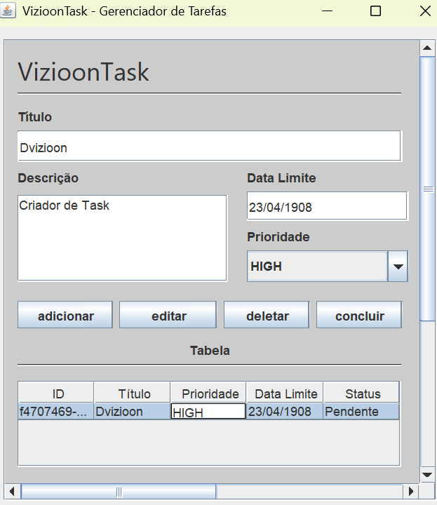
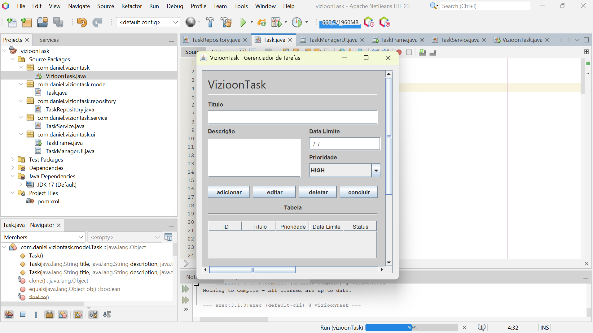
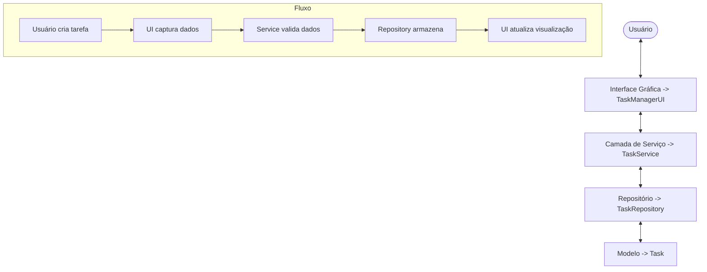

# VizioonTask - Gerenciador de Tarefas



## Sobre o Projeto

VizioonTask é um aplicativo de gerenciamento de tarefas desenvolvido em Java utilizando a biblioteca Swing para interface gráfica. Este projeto foi criado como parte da disciplina de Projeto de Software para aplicar os princípios da metodologia ágil Scrum.

**Autor:** Daniel Estevão

## Características

> [!TIP]
> - Criação, edição e exclusão de tarefas
> - Definição de prioridades (Alta, Média, Baixa)
> - Controle de datas e prazos
> - Marcação de tarefas como concluídas
> - Interface gráfica simples e intuitiva
> - Validação de dados de entrada

## Exemplos de Uso

### 1. Criando e gerenciando tarefas via código

```java
// Inicializar o serviço
TaskRepository repository = new TaskRepository();
TaskService service = new TaskService(repository);

// Criar uma nova tarefa
Task task = service.createTask(
    "Estudar Java", 
    "Revisar conceitos de Swing e arquitetura em camadas", 
    LocalDate.now().plusDays(7), 
    Task.Priority.HIGH
);

// Marcar como concluída
service.markTaskAsCompleted(task.getId());

// Encontrar tarefas atrasadas
List<Task> overdueTasks = service.findOverdueTasks();
for (Task t : overdueTasks) {
    System.out.println("Tarefa atrasada: " + t.getTitle());
}

// Filtrar tarefas por status
List<Task> completedTasks = service.findCompletedTasks();
List<Task> pendingTasks = service.findIncompleteTasks();
```

### 2. Estendendo a aplicação

```java
// Exemplo: Adicionando funcionalidade de exportação para CSV
public void exportToCsv(String filePath) throws IOException {
    List<Task> tasks = service.findAllTasks();
    StringBuilder csv = new StringBuilder();
    csv.append("ID,Título,Descrição,Data Limite,Prioridade,Concluída\n");
    
    for (Task task : tasks) {
        csv.append(String.format("%s,%s,%s,%s,%s,%s\n",
            task.getId(),
            task.getTitle().replace(",", ";"),
            task.getDescription().replace(",", ";"),
            task.getDueDate(),
            task.getPriority(),
            task.isCompleted()
        ));
    }
    
    Files.writeString(Paths.get(filePath), csv.toString());
}
```

## Screenshots




## Tecnologias Utilizadas

- Java 17
- Swing (GUI)
- Maven (Gerenciamento de dependências)
- Apache NetBeans IDE

## Arquitetura

O projeto foi desenvolvido seguindo uma arquitetura em camadas:

- **Model**: Classes de modelo que representam entidades como Task
- **Repository**: Camada de acesso a dados
- **Service**: Lógica de negócios e regras da aplicação
- **UI**: Interface gráfica e interação com o usuário

### Principais Classes e Métodos

#### Model (Task.java)
```java
// Criar uma nova tarefa
Task task = new Task("Título", "Descrição", LocalDate.now(), Task.Priority.MEDIUM);

// Métodos disponíveis
task.getId();                 // Retorna o ID único da tarefa
task.getTitle();              // Retorna o título
task.setTitle(String title);  // Define o título
task.getDescription();        // Retorna a descrição
task.getDueDate();            // Retorna a data limite
task.isCompleted();           // Verifica se está concluída
task.setCompleted(boolean);   // Define status de conclusão
task.getPriority();           // Retorna a prioridade
task.setPriority(Priority);   // Define a prioridade
task.isOverdue();             // Verifica se está atrasada
task.isDueSoon();             // Verifica se está próxima do prazo
```

#### Repository (TaskRepository.java)
```java
TaskRepository repository = new TaskRepository();

// Métodos disponíveis
repository.save(Task task);               // Salva ou atualiza uma tarefa
repository.findById(String id);           // Busca uma tarefa pelo ID
repository.findAll();                     // Retorna todas as tarefas
repository.findByCompleted(boolean);      // Filtra por status
repository.delete(Task task);             // Remove uma tarefa
repository.deleteById(String id);         // Remove pelo ID
repository.findOverdueTasks();            // Encontra tarefas atrasadas
repository.findTasksDueSoon();            // Encontra tarefas com prazo próximo
```

#### Service (TaskService.java)
```java
TaskRepository repository = new TaskRepository();
TaskService service = new TaskService(repository);

// Métodos disponíveis
service.createTask(String title, String description, LocalDate dueDate, Task.Priority priority);
service.updateTask(Task task);
service.deleteTask(String taskId);
service.findTaskById(String taskId);
service.findAllTasks();
service.findCompletedTasks();
service.findIncompleteTasks();
service.findOverdueTasks();
service.findTasksDueSoon();
service.markTaskAsCompleted(String taskId);
service.markTaskAsIncomplete(String taskId);
```

### Diagrama de Fluxo



## Estrutura de Diretórios

```
viziontask/
├── src/
│   ├── main/
│   │   ├── java/
│   │   │   └── com/
│   │   │       └── daniel/
│   │   │           └── viziontask/
│   │   │               ├── model/
│   │   │               │   └── Task.java
│   │   │               ├── repository/
│   │   │               │   └── TaskRepository.java
│   │   │               ├── service/
│   │   │               │   └── TaskService.java
│   │   │               ├── ui/
│   │   │               │   ├── TaskManagerUI.java
│   │   │               │   └── TaskFrame.java
│   │   │               └── VizioonTask.java
│   │   └── resources/
│   └── test/
└── pom.xml
```

## Como Executar

### Pré-requisitos

> [!IMPORTANT]
> - Java JDK 17 ou superior
> - Maven (para compilação)

### Usando código fonte
1. Clone o repositório
   ```
   git clone https://github.com/danielestevao/viziontask.git
   cd viziontask
   ```

2. Compile o projeto
   ```
   mvn clean package
   ```

3. Execute o aplicativo
   ```
   java -jar target/viziontask-1.0-SNAPSHOT-jar-with-dependencies.jar
   ```

### Usando o JAR pré-compilado
1. Baixe o arquivo JAR da [seção de releases](https://github.com/danielestevao/viziontask/releases)
2. Execute com duplo clique ou via terminal:
   ```
   java -jar viziontask-1.0-SNAPSHOT-jar-with-dependencies.jar
   ```

## Guia de Uso

> [!TIP]
> O aplicativo foi projetado para ser intuitivo. Ao selecionar uma tarefa na tabela, seus detalhes serão automaticamente carregados no formulário para facilitar a edição.

### Adicionar uma nova tarefa
1. Preencha o campo "Título" (obrigatório)
2. Adicione uma descrição detalhada (opcional)
3. Selecione a data limite no formato DD/MM/AAAA
4. Escolha uma prioridade (Alta, Média, Baixa)
5. Clique no botão "Adicionar"

### Editar uma tarefa existente
1. Selecione a tarefa na tabela
2. Os dados serão carregados no formulário
3. Modifique os campos necessários
4. Clique no botão "Editar"

### Excluir uma tarefa
1. Selecione a tarefa na tabela
2. Clique no botão "Deletar"
3. Confirme a exclusão na caixa de diálogo

### Marcar como concluída
1. Selecione a tarefa na tabela
2. Clique no botão "Concluir"
3. O status da tarefa será alterado

## Desenvolvimento

Este projeto foi desenvolvido seguindo os princípios da metodologia ágil Scrum:

> [!NOTE]
> - Product Backlog elaborado com histórias de usuário
> - Priorização de funcionalidades por valor de negócio
> - Desenvolvimento incremental e iterativo
> - Quadro Kanban para acompanhamento de tarefas
> - Foco no MVP (Produto Mínimo Viável)

> [!WARNING]
> Este é um projeto acadêmico desenvolvido para a disciplina de Projeto de Software. Algumas funcionalidades ainda estão em desenvolvimento.

## Links do Projeto

- [Repositório GitHub](https://github.com/dvizioon/VIZIOONTASK)
- [Quadro Trello (Kanban)](https://trello.com/b/OTc2nE3m)
- [Protótipo Figma](https://www.figma.com/design/EoTGiENcBNSRzLeYhaJynk/vizioonTask?node-id=0-1&t=ps7zMFsPCvBoqOJJ-1)

## Licença

Este projeto é licenciado sob a licença MIT - veja o arquivo [LICENSE](LICENSE) para mais detalhes.
